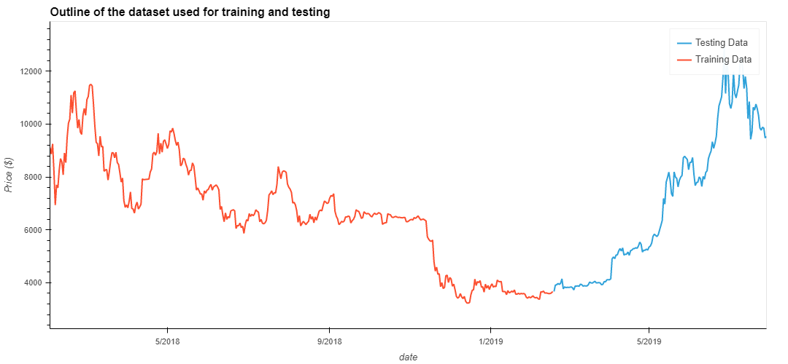
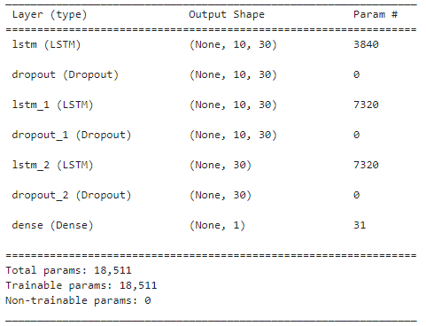
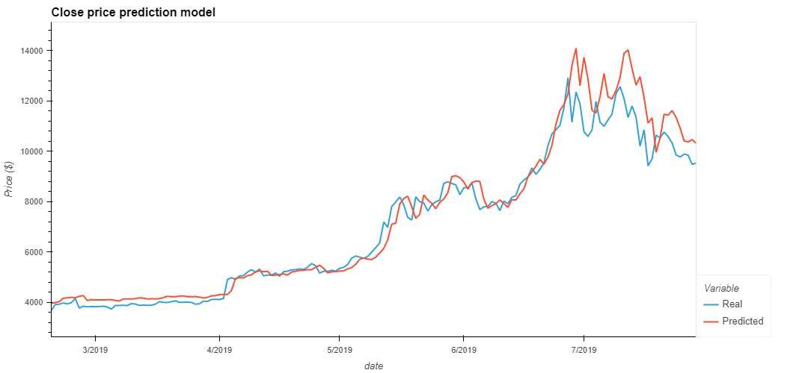
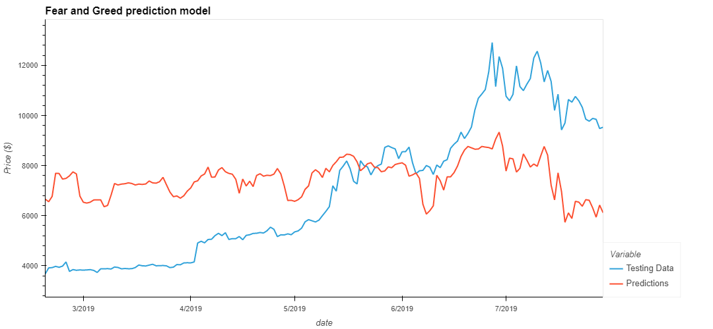
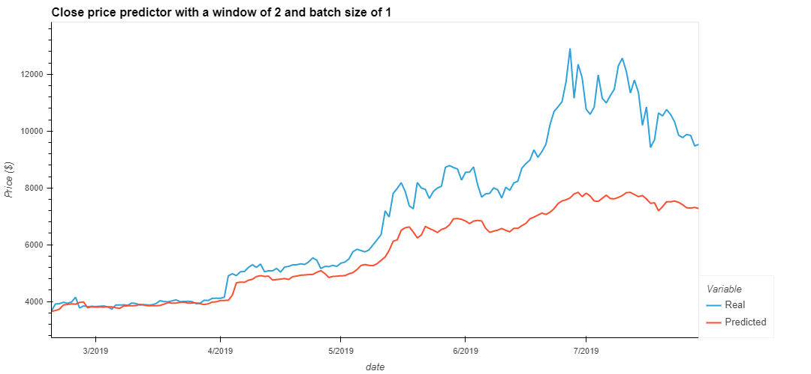
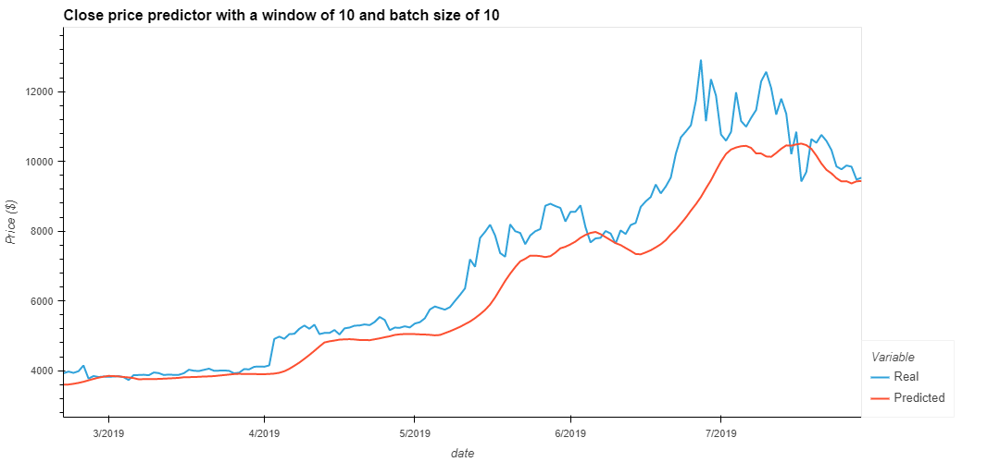

# Fintech--Deep-Learning
Long Short Term Memory neurons (LSTM's) are an exciting variation on the typical neuron seen in Nueral networks, as they retain information across mulitiple data points. This repo has explored the application of LSTM's and Deep neural networks (DNN's) for time series data with the goal of producing a rudimentary model to predict the price of cryptocurrencies. The data used to train the model was the closing price of Bitcoin between 2017 and 2020.

---

## Model architecture
The architecture for the model was chosen rather arbitrarily, The DNN contained 3 LSTM layers, each with a dropout layer with 10% attenuation, the output layer was a dense layer with one neuron. The first two LSTM layers generated return sequences with the final LSTM layer outputting LSTM vectors as input into the dense layer.

---

## Predictions using closing stock price
A rolling window of data was generated from the original closing price data. This rolling window was then used as the feature dataset for the LSTM DNN, predictions were made on the next time step in the sequence.

## Predictions using Fear and Greed index
Similar to the closing stock price, a rolling window of the fear and greed (FnG) index was used as the feature dataset, closing price predictions were generated in much the same way.

---

# Discussion
For the two models seen above, a rolling window of 2 and a batch size of 10 was chosen as these parameters produced the lowest loss values for each model with a loss of 0.0075 and 0.0977 for the Close and FnG predictors respectivly. These parameters also appeared to fit the predicted signal closely to the real signal.

Neither model would be particularly good at predicting the stock price as both models have a large lag for accurate predictions. Additionally, the FnG model has failed to capture the overall market sentiment and does not appear to follow the medium/long term trend of the signal.

---

## Effect of batching
Changing the batch size controls the accuracy of the estimator when training the neural netowork. For this particular case, the batch size when training the neural network affected the models resposivness to large price swings, a smaller batch size gave a relativly flatter predictive signal.

## Effect of rolling window size
The length of the rolling window plays a pivitol role in the model's ability to recall time series data and act on prior price action. Period of 2 and 10 steps were experimented with to visualise the impact of this hyperparameter.
The figure below illustrates how a larger window serves to smooth the responsivness of a predicted signal.

